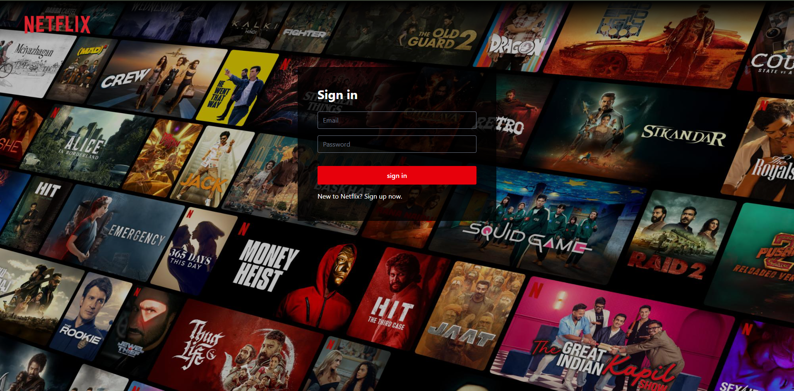

# Netflix-GPT 🎬

Your AI-powered, Netflix-style movie recommendation companion built with React, OpenAI GPT, TMDB, Firebase and Tailwind CSS.

## 🚀 Features

- **Natural Language Search**: Chat with the assistant to discover movies or shows tailored to your preferences
- **Personalized Recommendations**: Using OpenAI openrouter/horizon-beta model in combination with the TMDB API for context-aware suggestions
- **Authentication**: Secure login/sign-up powered by Firebase Auth
- **Performance Optimization**: Memoization & caching to reduce unnecessary API calls
- **Trailer Background Experience**: Autoplayed video trailer backgrounds for featured titles

## 📸 Screenshots



## 🧰 Tech Stack

- **React + Vite** (or Create React App)
- **Tailwind CSS**
- **Redux Toolkit** for state management
- **Firebase** (Auth + Hosting)
- **TMDB API** for movie metadata
- **OpenAI GPT-3.5/4** for conversational recommendations

## ⚙️ Prerequisites

Before running, make sure you have:

- Node.js and npm/yarn
- A Firebase project with Authentication and Hosting enabled
- API keys:
  - `OPEN_ROUTER_KEY`
  - `TMDB_API_KEY`
  - Firebase config variables (e.g. `FIREBASE_API_KEY`, etc.)

Add them to a `.env` file:

```env
VITE_OPEN_ROUTER_KEY=your_openai_key
VITE_TMDB_KEY=your_tmdb_key
VITE_FIREBASE_API_KEY=your_firebase_api_key
# ...other Firebase config values
```

## 🚧 Installation

```bash
# Clone the repository
git clone https://github.com/nbanurag/netflix-gpt.git
cd netflix-gpt

# Install dependencies
npm install

# Launch development server
npm run dev
```

Visit `http://localhost:5173` (or your development port) to explore locally.

## 📄 Project Structure

```
/
├── public/
├── src/
│   ├── components/
│   ├── hooks/         # Custom hooks (e.g. TMDB fetchers, GPT search)
│   ├── pages/         # Login, Browse, Search, etc.
│   ├── redux/         # Redux slices (e.g. userSlice, movieSlice, gptSlice)
│   ├── utils/         # Utility helpers
│   └── App.jsx
├── .env
├── tailwind.config.js
└── vite.config.js
```

## 🌟 Usage Overview

1. **Sign in / Sign up**: Secure user authentication via Firebase
2. **Browse View**: See featured movies with trailer backgrounds, descriptions, and curated lists
3. **GPT Search**: Type conversational queries like "Suggest me action films from the 2010s" and get GPT-powered suggestions processed via TMDB search

## 📞 Contact

**Your Name** – nb.anurag@gmail.com

Feel free to reach out for collaboration, feedback, or questions.

**Live demo**: [https://netflix-gpt-blond-xi.vercel.app/]